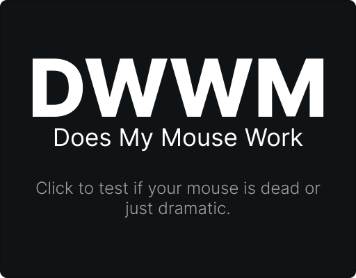

# 👾 Azur — Cursed Dev, Still Functional™

> _“I spend most of my time optimizing things that would take less time to be left unoptimized.”_

## 🧠 About Me

Hi, I’m Azur — fullstack web developer, part-time bug exorcist, full-time CSS survivor.  
I also train soon-to-be devs to suffer professionally.

I code, I teach, and I question my life choices every time Docker says “it works on my machine” and then... doesn’t.

## 🛠️ My (Un)Holy Stack

<h3 align="center"> 🖼️ Frontend</h3>

  
  
  
  
  
  
  

---

<h3 align="center">⚙️ Backend</h3>

  
  
  
  
  

---

<h3 align="center">🧪 Miscellaneous</h3>

  
  
  
  

💀 *I dislike PHP with passion, avoid CSS frameworks like the plague, and believe every site deserves more soul than Bootstrap gray.*

## 🧑‍🏫 Developer Trainer IRL

I train two kinds of people:
- **Web integrators** who fight their first battles against `float`, `position: absolute`, and their own patience.
- **Full-stack devs** who get hit with Symfony, Docker, UML diagrams, automated tests, and despair.

I use GitHub as an educational tool to create briefs, tasks, and commit messages that say more about life than any philosopher could.

## 🧪 Side Projects

- **[DevHub (FR)](https://Azur-tsx.github.io/devhub/)** — A resource hub I created to help my students survive the web dev jungle. If it saves them one ChatGPT prompt, it’s already a win.  

- **[Does My Mouse Work (EN)](https://Azur-tsx.github.io/DMMW/)** — a completely serious tool to check if your mouse is alive. You're welcome.  

- **[README Factory (FR)](https://azur-tsx.github.io/README-Factory/)** — Because everyone deserves a half-decent GitHub profile, even if they don't know what `markdown` is. Answer a few questions, get a readme, pretend your repo is alive.  

- **KMEasy (FR)** — A mileage tracker for caregivers and field workers who'd rather not spend their evenings doing math.
Just enter the addresses you visit, and KMEasy will calculate your routes automatically using the Google Maps API.
The backend is solid. The frontend? Let’s say it’s… on a personal growth journey.

## 🚧 Work in Progress

I’m polishing my old projects to build a proper portfolio.  
It takes time when you spend 3 hours refactoring a `div` just to center it.

## 📈 Useless Stats That Look Cool

## 📬 Contact

📩 azur-tsx@proton.me   
🕳️ Or whisper into the void. I might hear it.

---

> _If you're still reading this, please leave. You deserve better. So do I._
